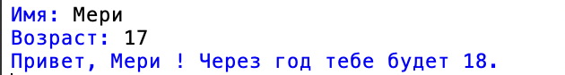
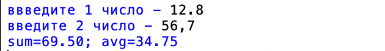
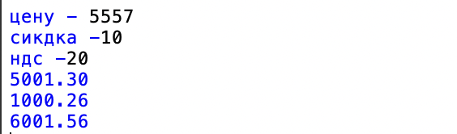
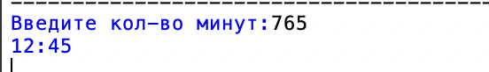
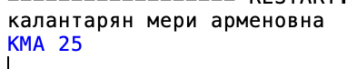
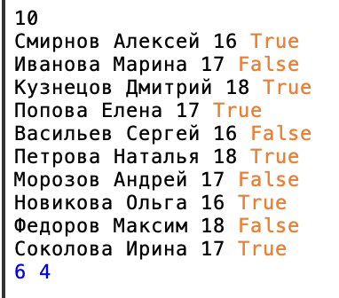

# Калантарян Мери 

# Лабораторная работа 1 

## Задание 1 **
```
name = input("Имя: ")
age = int(input("Возраст: "))
print(f"Привет, {name}! Через год тебе будет {age + 1}.")
```


## Задание 2 
```

def f(number):
    return float(number.replace(',', '.'))
num1 = f(input("ввведите 1 число - "))
num2 = f(input("введите 2 число - "))

_sum = num1 + num2
avg = _sum / 2

print(f"sum={_sum:.2f}; avg={avg:.2f}")
```


## Задание 3
```

price = float(input("цену -" ))
discount = float(input("сикдка -"))
vat = float(input("ндс -"))

base = price * (1 - discount / 100)
vat_amount = base * (vat / 100)
total = base + vat_amount

print(f"{base:.2f}")
print(f"{vat_amount:.2f}")
print(f"{total:.2f}")
```


## Задание 4
 ```

 m = int(input("Введите кол-во минут:"))

hours = m // 60
minutes = m % 60

print(f"{hours:02d}:{minutes:02d}")
 ```


 ## Задание 5 
```

fio = input().strip() # strip- удаляет лишние пробелы 
parts = fio.split()
initsial = ''.join(part[0].upper() for part in parts)
cleaned_length = len(' '.join(parts))
print(f"{initsial} {cleaned_length}")
```


 ## Задание 6
 ```
N = int(input())
count_full_time = 0
count_part_time = 0

for _ in range(N):
    line = input().split()
    participation_format = line[3] == 'True'
    if participation_format:
        count_full_time += 1
    else:
        count_part_time += 1

print(count_full_time, count_part_time)
 ```
 
