# Калантарян Мери 

# Лабараторная работа  6 

## cli_convert
```
import argparse # для обработки аргументов командной строки
from pathlib import Path 
import sys


def check_file_exists(path_str: str):
    path = Path(path_str)
    if not path.exists():
        print(f"Ошибка: входной файл '{path}' не найден.", file=sys.stderr)
        sys.exit(1)
    return path

def json2csv(input_path: str, output_path: str):
    check_file_exists(input_path)
    print(f"[demo] Конвертация JSON → CSV: {input_path} → {output_path}")
    # json_to_csv(input_path, output_path)


def csv2json(input_path: str, output_path: str):
    check_file_exists(input_path)
    print(f"[demo] Конвертация CSV → JSON: {input_path} → {output_path}")
    # csv_to_json(input_path, output_path)


def csv2xlsx(input_path: str, output_path: str):
    check_file_exists(input_path)
    print(f"[demo] Конвертация CSV → XLSX: {input_path} → {output_path}")
    # csv_to_xlsx(input_path, output_path)


def main():
    parser = argparse.ArgumentParser(description="CLI-конвертеры данных (ЛР6)")
    sub = parser.add_subparsers(dest="cmd", required=True)

    # ---- json2csv ----
    p1 = sub.add_parser("json2csv", help="Преобразовать JSON в CSV")
    p1.add_argument("--in", dest="input", required=True, help="Входной JSON-файл")
    p1.add_argument("--out", dest="output", required=True, help="Выходной CSV-файл")

    # ---- csv2json ----
    p2 = sub.add_parser("csv2json", help="Преобразовать CSV в JSON")
    p2.add_argument("--in", dest="input", required=True, help="Входной CSV-файл")
    p2.add_argument("--out", dest="output", required=True, help="Выходной JSON-файл")

    # ---- csv2xlsx ----
    p3 = sub.add_parser("csv2xlsx", help="Преобразовать CSV в XLSX")
    p3.add_argument("--in", dest="input", required=True, help="Входной CSV-файл")
    p3.add_argument("--out", dest="output", required=True, help="Выходной XLSX-файл")

    args = parser.parse_args()

    if args.cmd == "json2csv":
        json2csv(args.input, args.output)
    elif args.cmd == "csv2json":
        csv2json(args.input, args.output)
    elif args.cmd == "csv2xlsx":
        csv2xlsx(args.input, args.output)
if __name__ == "__main__":
    main()
```
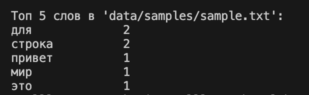

## cli_text


```

import argparse
from pathlib import Path
import sys


def cat_command(input_path: str, numbered: bool = False):
    """Вывод содержимого файла построчно"""
    path = Path(input_path)
    if not path.exists():
        print(f"Ошибка: файл '{input_path}' не найден.", file=sys.stderr)
        sys.exit(1)

    with path.open(encoding="utf-8") as f:
        for i, line in enumerate(f, start=1):
            if numbered:
                print(f"{i:4d}: {line.rstrip()}")
            else:
                print(line.rstrip())


def stats_command(input_path: str, top_n: int = 5):
    """Простейший анализ частот слов (упрощённо, если нет lab03)"""
    path = Path(input_path)
    if not path.exists():
        print(f"Ошибка: файл '{input_path}' не найден.", file=sys.stderr)
        sys.exit(1)

    with path.open(encoding="utf-8") as f:
        text = f.read().lower()

    words = [w.strip(".,!?;:\"'()[]") for w in text.split()]
    freq = {}
    for w in words:
        if not w:
            continue
        freq[w] = freq.get(w, 0) + 1

    sorted_items = sorted(freq.items(), key=lambda x: x[1], reverse=True)[:top_n]

    print(f"Топ {top_n} слов в '{input_path}':")
    for word, count in sorted_items:
        print(f"{word:15s} {count}")


def main():
    parser = argparse.ArgumentParser(
        description="CLI-утилиты для анализа текста (cat, stats)"
    )
    subparsers = parser.add_subparsers(dest="command", required=True)

    # ---- cat ----
    cat_parser = subparsers.add_parser("cat", help="Вывести содержимое файла")
    cat_parser.add_argument("--input", required=True, help="Путь к файлу")
    cat_parser.add_argument("-n", action="store_true", help="Нумеровать строки")

    # ---- stats ----
    stats_parser = subparsers.add_parser("stats", help="Частоты слов")
    stats_parser.add_argument("--input", required=True, help="Путь к текстовому файлу")
    stats_parser.add_argument("--top", type=int, default=5, help="Количество топ-слов")

    args = parser.parse_args()

    if args.command == "cat":
        cat_command(args.input, args.n)
    elif args.command == "stats":
        stats_command(args.input, args.top)
if __name__ == "__main__":
    main()

```
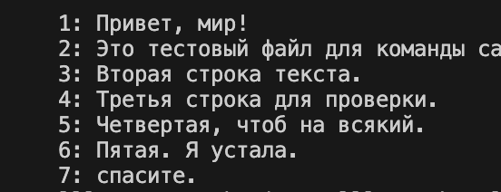


# Лабараторная работа 5 

## csv_xlsx
```
import csv
from pathlib import Path
from openpyxl import Workbook
from openpyxl.utils import get_column_letter

def csv_to_xlsx(csv_path: str, xlsx_path: str) -> None:
    """CSV → XLSX"""
    cpath = Path(csv_path)
    if not cpath.exists():
        raise FileNotFoundError(f"Нет файла: {csv_path}")

    with cpath.open(encoding="utf-8") as f:
        rows = list(csv.reader(f))
    if not rows:
        raise ValueError("Пустой CSV")

    wb = Workbook()
    ws = wb.active
    ws.title = "Sheet1"

    for row in rows:
        ws.append(row)

    # Автоширина
    for col in ws.columns:
        length = max(len(str(cell.value or "")) for cell in col)
        ws.column_dimensions[get_column_letter(col[0].column)].width = max(8, length + 2)

    wb.save(xlsx_path)


if __name__ == "__main__":
    csv_to_xlsx("data/samples/cities.csv", "data/out/cities.xlsx")
    csv_to_xlsx("data/samples/people.csv", "data/out/people.xlsx")
```
## json_csv
```
 # src/lab05/json_csv.py
import json
import csv
from pathlib import Path


def json_to_csv(json_path: str, csv_path: str) -> None:
    """
    Преобразует JSON-файл в CSV.
    Поддерживает список словарей [{...}, {...}], заполняет отсутствующие поля пустыми строками.
    Кодировка UTF-8. Порядок колонок — как в первом объекте или алфавитный (указать в README).
    """
    json_file = Path(json_path)
    csv_file = Path(csv_path)
    
    if not json_file.exists():
        raise FileNotFoundError(f"JSON файл не найден: {json_path}")
    
    if json_file.suffix.lower() != '.json':
        raise ValueError(f"Неверный тип файла: ожидается .json, получен {json_file.suffix}")
    
    try:
        with open(json_file, 'r', encoding='utf-8') as f:
            data = json.load(f)
    except json.JSONDecodeError as e:
        raise ValueError(f"Ошибка декодирования JSON: {e}")
    
    if not isinstance(data, list):
        raise ValueError("JSON должен содержать список объектов")
    
    if not data:
        raise ValueError("JSON файл пустой")
    
    if not all(isinstance(item, dict) for item in data):
        raise ValueError("Все элементы JSON должны быть словарями")
    
    all_fields = set()
    for item in data:
        all_fields.update(item.keys())
    fieldnames = sorted(all_fields)
    
    try:
        with open(csv_file, 'w', encoding='utf-8', newline='') as f:
            writer = csv.DictWriter(f, fieldnames=fieldnames)
            writer.writeheader()
            
            for row in data:
                complete_row = {field: str(row.get(field, '')) for field in fieldnames}
                writer.writerow(complete_row)
                
    except Exception as e:
        raise ValueError(f"Ошибка записи CSV: {e}")


def csv_to_json(csv_path: str, json_path: str) -> None:
    """
    Преобразует CSV в JSON (список словарей).
    Заголовок обязателен, значения сохраняются как строки.
    json.dump(..., ensure_ascii=False, indent=2)
    """
    csv_file = Path(csv_path)
    json_file = Path(json_path)
    
    if not csv_file.exists():
        raise FileNotFoundError(f"CSV файл не найден: {csv_path}")
    
    if csv_file.suffix.lower() != '.csv':
        raise ValueError(f"Неверный тип файла: ожидается .csv, получен {csv_file.suffix}")
    
    try:
        with open(csv_file, 'r', encoding='utf-8') as f:
            reader = csv.DictReader(f)
            fieldnames = reader.fieldnames
            
            if not fieldnames:
                raise ValueError("CSV файл не содержит заголовка")
            
            rows = list(reader)
            
    except Exception as e:
        raise ValueError(f"Ошибка чтения CSV: {e}")
    
    if not rows:
        raise ValueError("CSV файл пустой (нет данных, только возможный заголовок)")
    
    data = []
    for row in rows:
        string_row = {key: str(value) if value is not None else '' for key, value in row.items()}
        data.append(string_row)
    
    try:
        with open(json_file, 'w', encoding='utf-8') as f:
            json.dump(data, f, ensure_ascii=False, indent=2)
            
    except Exception as e:
        raise ValueError(f"Ошибка записи JSON: {e}")
    


    # пример использования
if __name__ == "__main__":
    # JSON -> CSV
    json_to_csv("data/samples/people.json", "data/out/people_from_json.csv")
    
    # CSV -> JSON  
    csv_to_json("data/samples/people.csv", "data/out/people_from_csv.json")
```
## Входные данные 
```
# data/samples/cities.csv
city,population,area_km2,foundation_year
Москва,12678079,2561,1147
Санкт-Петербург,5398064,1439,1703
Казань,1257341,614,1005
Новосибирск,1625631,502,1893
```
```
# data/samples/people.csv
name,age,city,profession,salary
Алексей,25,Москва,Инженер,
Мария,30,Санкт-Петербург,,80000
Иван,28,Казань,Разработчик,90000
```
```
[
  {
    "name": "Алексей",
    "age": 25,
    "city": "Москва",
    "profession": "Инженер"
  },
  {
    "name": "Мария",
    "age": 30,
    "city": "Санкт-Петербург",
    "salary": 80000
  },
  {
    "name": "Иван",
    "age": 28,
    "city": "Казань",
    "profession": "Разработчик",
    "salary": 90000
  }
]
```
## Вывод 
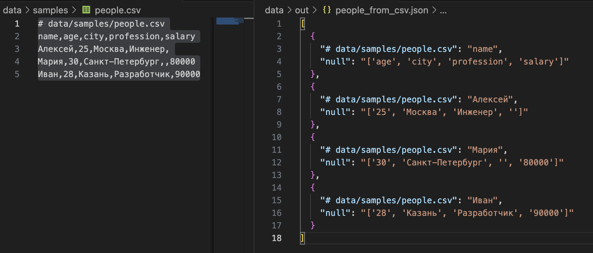
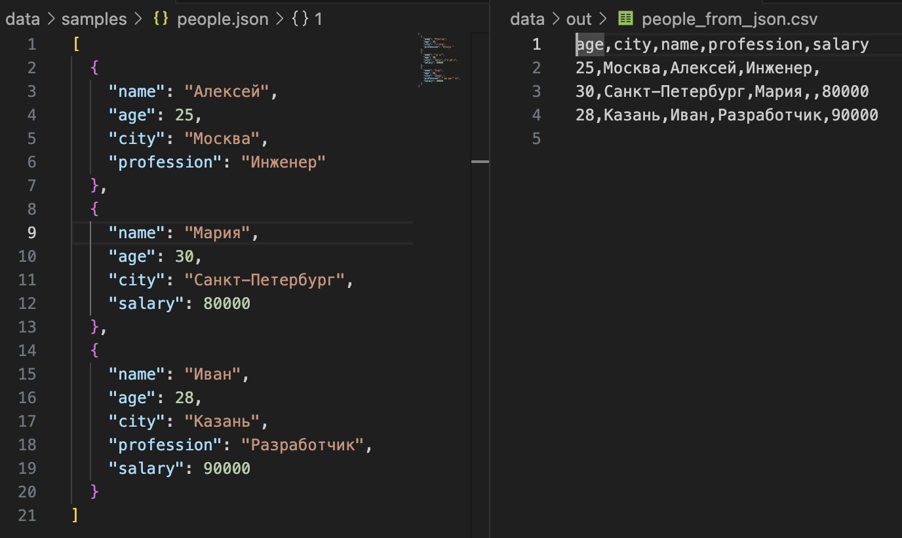


# Лабараторная работа 4 

## io_txt_csv
```
import csv
from pathlib import Path

def read_text(path: str | Path, encoding: str = "utf-8") -> str:
    with open(path, 'r', encoding=encoding) as file:
        return file.read()

def write_csv(rows: list[tuple | list], path: str | Path, header: tuple[str, ...] | None = None) -> None:
    if rows:
        first_len = len(rows[0])
        for i, row in enumerate(rows):
            if len(row) != first_len:
                raise ValueError(f"Строка {i} имеет длину {len(row)}, ожидается {first_len}")
    ensure_parent_dir(path)
    with open(path, 'w', newline='', encoding='utf-8') as file:
        writer = csv.writer(file)
        if header is not None:
            writer.writerow(header)
        writer.writerows(rows)

def ensure_parent_dir(path: str | Path) -> None:
    Path(path).parent.mkdir(parents=True, exist_ok=True)
```
## text_report
```
import re
import argparse
from pathlib import Path
from io_txt_csv import read_text, write_csv

def normalize(text: str, *, casefold: bool = True, yo2e: bool = True) -> str:
    text=text.replace('\n',' ').replace('\t',' ').replace('\r',' ')
    while '  ' in text:
        text=text.replace('  ',' ')
    text=text.strip()
    if yo2e:
        text=text.replace('ё','е').replace('Ё','Е')
    if casefold:
        text=text.casefold()
    return text


def tokenize(text: str) -> list[str]:
    text=''.join(char for char in text if char.isalpha()\
    or char.isspace() or char == '-' or char in '0123456789')
    text=text.split()
    return text

def count_freq(tokens: list[str]) -> dict[str, int]:
    freq = {}
    for token in tokens:
        if token in freq:
            freq[token] += 1
        else:
            freq[token] =1
    return freq


def top_n(freq: dict[str, int], n: int = 5) -> list[tuple[str, int]]:
    sorted_items = sorted(freq.items(), key=lambda x: (-x[1], x[0]))#получаем пары слов,сорт(по уб,по вз)
    return sorted_items[:n]


def main():
    parser = argparse.ArgumentParser(description='Анализ текста и создание отчета')
    parser.add_argument('--in', dest='input_file', default='data/lab04/input.txt',
                       help='Входной текстовый файл (по умолчанию: data/lab04/input.txt)')
    parser.add_argument('--out', dest='output_file', default='data/lab04/report.csv',
                       help='Выходной CSV файл (по умолчанию: data/lab04/report.csv)')
    parser.add_argument('--encoding', default='utf-8',
                       help='Кодировка файла (по умолчанию: utf-8, для Windows: cp1251)')
    args = parser.parse_args()
    
    try:
        print(f"Чтение файла: {args.input_file}")
        text = read_text(args.input_file, encoding=args.encoding)
        print("Анализ текста...")
        normalized = normalize(text)
        tokens = tokenize(normalized)
        word_counts = count_freq(tokens)
        sorted_words = sorted(word_counts.items(), 
                             key=lambda x: (-x[1], x[0]))
        print(f"Сохранение отчета: {args.output_file}")
        rows = [(word, count) for word, count in sorted_words]
        header = ("word", "count")
        write_csv(rows, args.output_file, header)
        print("\n--- ОТЧЕТ ---")
        print(f"Всего слов: {len(tokens)}")
        print(f"Уникальных слов: {len(word_counts)}")
        print("Топ-5:")
        freq = count_freq(tokens)
        top_words = top_n(freq, 5)
        for word, count in top_words:
            print(f"{word}:{count}")
        print(f"\nОтчет сохранен в: {args.output_file}")
        
    except FileNotFoundError:
        return 'FileNotFoundError'
    except UnicodeDecodeError:
        return 'UnicodeDecodeError'
    except Exception:
        return 'Exception'

if __name__ == "__main__":
    main()
```


# Лабараторная работа 3

## Задание А 
## А1
```
def normalize(text: str, *, casefold: bool = True, yo2e: bool = True) -> str:
    text=text.replace('\n',' ').replace('\t',' ').replace('\r',' ')
    while '  ' in text:
        text=text.replace('  ',' ')
    text=text.strip()
    if yo2e:
        text=text.replace('ё','е').replace('Ё','Е')
    if casefold:
        text=text.casefold()
    return text

print(normalize("ПрИвЕт\nМИр\t"))
print(normalize("ёжик, Ёлка"))
print(normalize("Hello\r\nWorld"))
print(normalize("  двойные   пробелы  "))
```
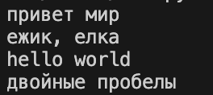

## A2
```
def tokenize(text: str) -> list[str]:
    text=''.join(char for char in text if char.isalpha()\
    or char.isspace() or char == '-' or char in '0123456789')
    text=text.split()
    return text
print(tokenize("привет мир"))
print(tokenize("hello, world!!!"))
print(tokenize("по-настоящему круто"))
print(tokenize("2025 год"))
print(tokenize("emoji 😀 не слово"))
```
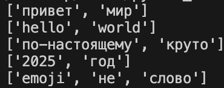

## A3
```
def count_freq(tokens: list[str]) -> dict[str, int]:
    freq = {}
    for token in tokens:
        if token in freq:
            freq[token] += 1
        else:
            freq[token] =1
    return freq

tokens1 = ["a","b","a","c","b","a"]
freq1 = count_freq(tokens1)
tokens2 = ["bb","aa","bb","aa","cc"]
freq2 = count_freq(tokens2)

print(f"Токены {tokens1} → частоты {freq1}")
print(f"Токены {tokens2} → частоты {freq2}")
```
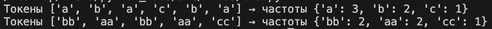

## A4
```
def count_freq(tokens: list[str]) -> dict[str, int]:
    freq = {}
    for token in tokens:
        if token in freq:
            freq[token] += 1
        else:
            freq[token] =1
    return freq

def top_n(freq: dict[str, int], n: int = 5) -> list[tuple[str, int]]:
    sorted_items = sorted(freq.items(), key=lambda x: (-x[1], x[0]))#получаем пары слов,сорт(по уб,по вз)
    return sorted_items[:n]

tokens1 = ["a","b","a","c","b","a"]
freq1 = count_freq(tokens1)
tokens2 = ["bb","aa","bb","aa","cc"]
freq2 = count_freq(tokens2)

print(f"top_n(..., n=2) → {top_n(freq1, 2)}")
print(f"top_n(..., n=2) → {top_n(freq2, 2)}")
```
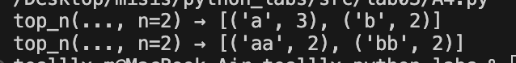

## Задание В
```
import sys
import os
from lib import text as txt

def main():
    text = input()
    normalized_text = txt.normalize(text, casefold=True, yo2e=True)
    tokens = txt.tokenize(normalized_text)
    total_words = len(tokens)
    unique_words = len(set(tokens))
    freq = txt.count_freq(tokens)
    top_words = txt.top_n(freq, 5)
    print(f"Всего слов: {total_words}")
    print(f"Уникальных слов: {unique_words}")
    print("Топ-5:")
    for word, count in top_words:
        print(f"{word}:{count}")
```
    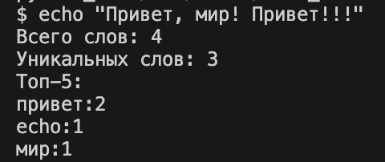


# Лабараторная работа 2 

## Задание A
## A1
```
def min_max(nums: list[float | int]) -> tuple[float | int, float | int]:
    if not nums:
        return 'ValueError'
    return min(nums), max(nums)
print(min_max([3, -1, 5, 5, 0]))
print(min_max([42]))
print(min_max([-5, -2, -9]))
print(min_max([]))
print(min_max([1.5, 2, 2.0, -3.1]))
```
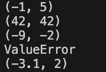

## A2
```
def unique_sorted(nums: list[float | int]) -> list[float | int]:
    return sorted(set(nums))

print(unique_sorted([3, 1, 2, 1, 3]))
print(unique_sorted([]))
print(unique_sorted([-1, -1, 0, 2, 2]))
print(unique_sorted([1.0, 1, 2.5, 2.5, 0]))
```
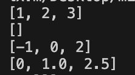

## A3
```
def flatten(mat: list[list | tuple]) -> list:
    result = []
    for element in mat:
        if isinstance(element, (list, tuple)):
            result.extend(element)
        else:
            return 'TypeError'
    return result

print(flatten([[1, 2], [3, 4]]))
print(flatten([[1, 2], (3, 4, 5)]))
print(flatten([[1], [], [2, 3]]))
print(flatten([[1, 2], "ab"]))
```
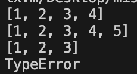

## Задание В 
## B1
```
def transpose(mat: list[list[float | int]]) -> list[list]:
    if not mat:
        return []
    num_cols = len(mat[0])
    for row in mat:
        if len(row) != num_cols:
            return 'ValueError'
    return [[mat[i][j] for i in range(len(mat))] for j in range(num_cols)]

print(transpose([[1, 2, 3]]))
print(transpose([[1], [2], [3]]))
print(transpose([[1, 2], [3, 4]]))
print(transpose([]))
print(transpose([[1, 2], [3]]))
```
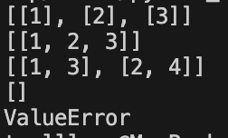

## B2
```
def row_sums(mat: list[list[float | int]]) -> list[float]:
    if not mat:
        return []
    num_cols = len(mat[0])
    for row in mat:
        if len(row) != num_cols:
            return 'ValueError'
    return [sum(row) for row in mat]

print(row_sums([[1, 2, 3], [4, 5, 6]]))
print(row_sums([[-1, 1], [10, -10]]))
print(row_sums([[0, 0], [0, 0]]))
print(row_sums([[1, 2], [3]]))
```
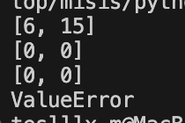

## B3
```
def col_sums(mat: list[list[float | int]]) -> list[float]:
    if not mat:
        return []
    num_cols = len(mat[0])
    for row in mat:
        if len(row) != num_cols:
           return 'ValueError'
    return [sum(mat[i][j] for i in range(len(mat))) for j in range(num_cols)]

print(col_sums([[1, 2, 3], [4, 5, 6]]))
print(col_sums([[-1, 1], [10, -10]]))
print(col_sums([[0, 0], [0, 0]]))
print(col_sums([[1, 2], [3]]))
```
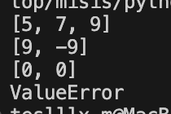

## Задание С
## C1
```
def format_record(rec: tuple[str, str, float]) -> str:
    fio, group, gpa = rec
    parts = fio.split()
    surname = parts[0]
    initials = ''.join(f"{name[0].upper()}." for name in parts[1:])
    return f"{surname[0].upper()}{surname[1:]} {initials}, гр. {group}, GPA {gpa:.2f}"

print(format_record(("Иванов Иван Иванович", "BIVT-25", 4.6)))
print(format_record(("Петров Пётр", "IKBO-12", 5.0)))
print(format_record(("Петров Пётр Петрович", "IKBO-12", 5.0)))
print(format_record(("  сидорова  анна   сергеевна ", "ABB-01", 3.999)))
```
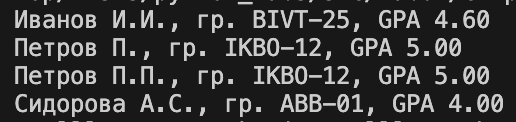

## С2
```
def format_record(rec: tuple[str, str, float]) -> str:
    fio, group, gpa = rec
    fio_parts = ' '.join(fio.split()).split()
    if len(fio_parts) < 2:
        return "ValueError"
    initials = []
    for name in fio_parts[1:]:  
        if name: 
            initials.append(f"{name[0].upper()}.")
    surname = fio_parts[0].title()
    return f"{surname} {' '.join(initials)}, гр. {' '.join(group.split())}, GPA {gpa:.2f}"

print(format_record(("Иванов Иван Иванович", "BIVT-25", 4.6)))
print(format_record(("Петров Пётр", "IKBO-12", 5.0)))
print(format_record(("Петров Пётр Петрович", "IKBO-12", 5.0)))
print(format_record(("  сидорова  анна   сергеевна ", "ABB-01", 3.999)))
```

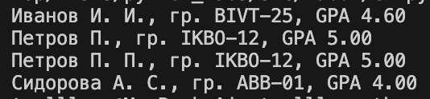


# Лабораторная работа 1 

## Задание 1 
```
name = input("Имя: ")
age = int(input("Возраст: "))
print(f"Привет, {name}! Через год тебе будет {age + 1}.")
```
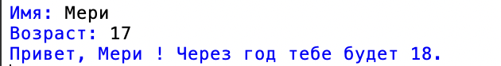

## Задание 2 
```

def f(number):
    return float(number.replace(',', '.'))
num1 = f(input("ввведите 1 число - "))
num2 = f(input("введите 2 число - "))

_sum = num1 + num2
avg = _sum / 2

print(f"sum={_sum:.2f}; avg={avg:.2f}")
```
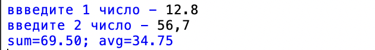

## Задание 3
```

price = float(input("цену -" ))
discount = float(input("сикдка -"))
vat = float(input("ндс -"))

base = price * (1 - discount / 100)
vat_amount = base * (vat / 100)
total = base + vat_amount

print(f"{base:.2f}")
print(f"{vat_amount:.2f}")
print(f"{total:.2f}")
```
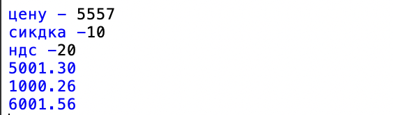

## Задание 4
 ```

 m = int(input("Введите кол-во минут:"))

hours = m // 60
minutes = m % 60

print(f"{hours:02d}:{minutes:02d}")
 ```
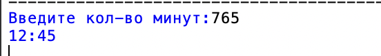

 ## Задание 5 

```

fio = input().strip() # strip- удаляет лишние пробелы 
parts = fio.split()
initsial = ''.join(part[0].upper() for part in parts)
cleaned_length = len(' '.join(parts))
print(f"{initsial} {cleaned_length}")
```
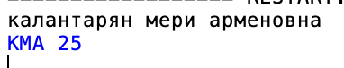

 ## Задание 6
 ```
N = int(input())
count_full_time = 0
count_part_time = 0

for _ in range(N):
    line = input().split()
    participation_format = line[3] == 'True'
    if participation_format:
        count_full_time += 1
    else:
        count_part_time += 1

print(count_full_time, count_part_time)
 ```
 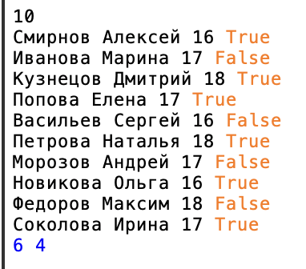
